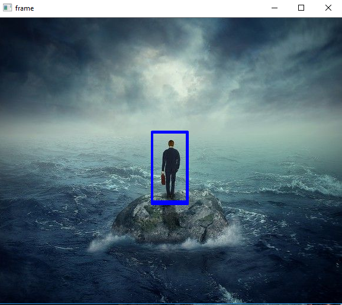

# Body Detection 
This is an example on how to implement a body detection using Opencv default Haar Cascade 
#### Required Modules :
  - Opencv   
    ```bash
      pip install opencv-python
#### Results 
  
 - Sample 
   
   
  
 
 - Output 
   
   
  
 
 - Saved Picture  
   
   
